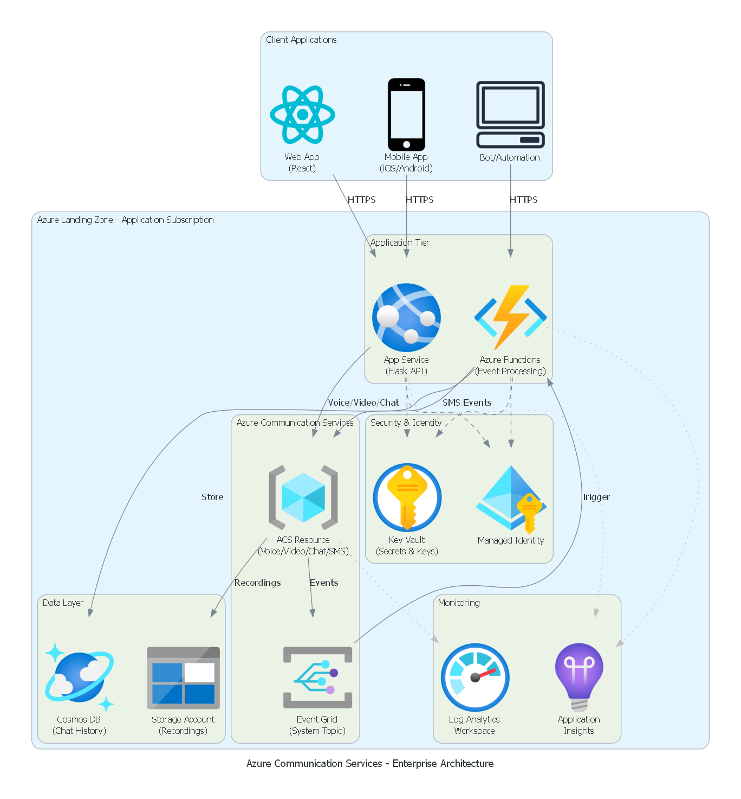
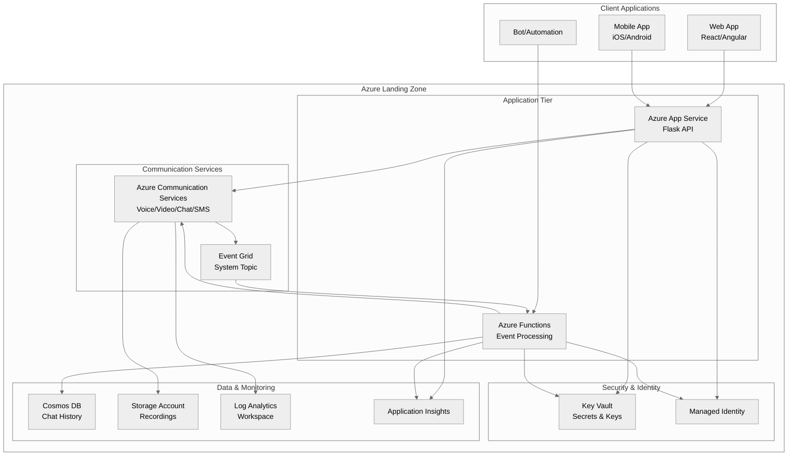

# Azure Communication Services - Enterprise Reference Architecture

[](https://portal.azure.com/#create/Microsoft.Template/uri/https%3A%2F%2Fraw.githubusercontent.com%2FStormyDevil%2Fazure-communication-services-reference%2Fmain%2Finfra%2Fbicep%2Fmain.json)
[](https://vscode.dev/redirect?url=vscode://ms-vscode-remote.remote-containers/cloneInVolume?url=https://github.com/StormyDevil/azure-communication-services-reference)
[](LICENSE)
[](https://learn.microsoft.com/azure/well-architected/)

> **Enterprise-grade Azure Communication Services solution** - Voice, Video, Chat, SMS, and Email capabilities aligned with Cloud Adoption Framework (CAF), Well-Architected Framework (WAF), and Azure Landing Zones.

## 🎯 Solution Overview

Azure Communication Services (ACS) is a cloud-based communications platform that enables developers to add voice, video, chat, SMS, and email capabilities to applications. This reference architecture demonstrates an enterprise-ready deployment following Microsoft best practices.

### What is Azure Communication Services?

Azure Communication Services provides:

| Capability | Description | Use Cases |
|------------|-------------|-----------|
| **Voice & PSTN** | VoIP calling, PSTN connectivity, call recording | Contact centers, telemedicine, customer support |
| **Video** | 1:1 and group video calls, screen sharing | Virtual consultations, remote collaboration |
| **Chat** | Real-time messaging with threading | In-app messaging, customer engagement |
| **SMS** | Send and receive SMS messages | Notifications, 2FA, alerts |
| **Email** | Transactional email delivery | Invoices, notifications, marketing |
| **Advanced Messaging** | WhatsApp, Teams interop | Multi-channel communication |

### Architecture Highlights



<details>
<summary>📊 View as Mermaid Diagram (text-based)</summary>



</details>

> 💡 **Additional diagrams**: See [Landing Zone Integration](docs/diagrams/acs_landing_zone.png) and [Data Flow](docs/diagrams/acs_data_flow.png). Regenerate with `python docs/diagrams/generate_diagram.py` (requires [Graphviz](https://graphviz.org/download/)).

## 📋 Prerequisites

- Azure subscription with Contributor access
- Azure CLI 2.50+ with Bicep CLI
- PowerShell 7+ (cross-platform)
- Python 3.9+ (for sample applications)
- Git 2.30+

### Required Azure Permissions

| Scope | Role | Purpose |
|-------|------|---------|
| Subscription | Contributor | Deploy resources |
| Entra ID | Application Administrator | Register applications |
| Communication Services | Owner | Manage ACS configuration |

## 🚀 Quick Start

### Option 1: Dev Container (Recommended)

Open this repository in a Dev Container for a fully configured development environment:

1. Install [VS Code](https://code.visualstudio.com/) and the [Dev Containers extension](https://marketplace.visualstudio.com/items?itemName=ms-vscode-remote.remote-containers)
2. Clone the repository and open in VS Code
3. Click "Reopen in Container" when prompted (or F1 → "Dev Containers: Reopen in Container")
4. Wait for the container to build (includes Azure CLI, Bicep, PowerShell, Python)

**Included in Dev Container:**
- Azure CLI with Bicep extension
- PowerShell 7+
- Python 3.11 with ACS SDK
- Node.js 20 LTS
- Azure Functions Core Tools
- VS Code extensions for Azure development

### Option 2: One-Click Deploy

```bash
# Clone the repository
git clone https://github.com/StormyDevil/azure-communication-services-reference.git
cd azure-communication-services-reference

# Deploy to Azure
pwsh ./scripts/deploy.ps1 -Environment dev -Location westus2
```

### Option 3: Step-by-Step Deployment

```bash
# 1. Login to Azure
az login

# 2. Set subscription
az account set --subscription "YOUR_SUBSCRIPTION_ID"

# 3. Create resource group
az group create --name rg-acs-dev --location swedencentral

# 4. Deploy infrastructure
az deployment group create \
    --name acs-deployment \
    --resource-group rg-acs-dev \
    --template-file infra/bicep/main.bicep \
    --parameters infra/bicep/parameters/dev.bicepparam
```

## 📁 Repository Structure

```
azure-communication-services-reference/
├── .env.example             # Environment variables template
├── .github/
│   ├── chatmodes/           # GitHub Copilot chat modes
│   └── workflows/           # CI/CD pipelines
├── docs/
│   ├── cost-estimate.md     # Cost estimation guide
│   ├── diagrams/            # Architecture diagrams (Python)
│   └── waf-assessment/      # Well-Architected assessment
├── infra/
│   └── bicep/
│       ├── main.bicep       # Main deployment template
│       ├── main.json        # Compiled ARM template
│       ├── modules/         # Reusable Bicep modules
│       │   ├── acs-secrets.bicep
│       │   ├── app-service.bicep
│       │   ├── communication-services.bicep
│       │   ├── cosmos-db.bicep
│       │   ├── event-grid.bicep
│       │   ├── function-app.bicep
│       │   ├── key-vault.bicep
│       │   ├── monitoring.bicep
│       │   └── storage.bicep
│       └── parameters/      # Environment parameters
│           ├── dev.bicepparam
│           └── prod.bicepparam
├── scripts/
│   ├── deploy.ps1           # Deployment script
│   ├── cleanup.ps1          # Cleanup script
│   ├── configure-acs.ps1    # Post-deployment configuration
│   ├── acs-config.json      # ACS configuration file
│   └── acs-config.schema.json
├── src/
│   └── python/
│       ├── app.py           # Flask REST API
│       ├── acs_sdk_sample.py # ACS SDK examples
│       ├── requirements.txt
│       └── functions/       # Azure Functions (event processing)
│           ├── function_app.py
│           ├── function.json
│           └── host.json
├── README.md
├── LICENSE
├── CONTRIBUTING.md
└── SECURITY.md
```

## 🏗️ Architecture Principles

### Cloud Adoption Framework (CAF) Alignment

| CAF Pillar | Implementation |
|------------|----------------|
| **Strategy** | Communication-as-a-Service for digital transformation |
| **Plan** | Phased rollout: Chat → Voice → Video → Advanced |
| **Ready** | Landing zone with security baseline |
| **Adopt** | ACS SDK integration patterns |
| **Govern** | Cost management, compliance policies |
| **Manage** | Monitoring, incident response |

### Well-Architected Framework Assessment

See [docs/waf-assessment/README.md](docs/waf-assessment/README.md) for the complete assessment.

| Pillar | Score | Key Recommendations |
|--------|-------|---------------------|
| **Reliability** | 85/100 | Multi-region, circuit breakers, retry policies |
| **Security** | 90/100 | Managed Identity, Key Vault, TLS 1.3 |
| **Cost Optimization** | 80/100 | Reserved capacity, auto-scaling |
| **Operational Excellence** | 85/100 | IaC, GitOps, monitoring |
| **Performance Efficiency** | 82/100 | CDN, connection pooling, caching |

### Azure Landing Zone Integration

This solution deploys into an Azure Landing Zone with:

- **Connectivity Subscription**: Hub network with ExpressRoute/VPN
- **Identity Subscription**: Entra ID integration
- **Management Subscription**: Monitoring, backup
- **Landing Zone Subscription**: ACS and application resources

## 🔧 Configuration

### Environment Variables

| Variable | Description | Required |
|----------|-------------|----------|
| `ACS_CONNECTION_STRING` | ACS connection string | Yes |
| `ACS_ENDPOINT` | ACS endpoint URL | Yes |
| `AZURE_TENANT_ID` | Entra ID tenant ID | Yes |
| `AZURE_CLIENT_ID` | Application client ID | For SDK auth |
| `COSMOS_CONNECTION_STRING` | Cosmos DB connection | For chat history |

### Parameters

Edit the parameter files in `infra/bicep/parameters/`:

```bicep
// parameters/dev.bicepparam
using '../main.bicep'

param environment = 'dev'
param projectName = 'acsref'
param enableSms = true
param enableVoice = true
param enableVideo = true
param enableChat = true
param enableEmail = false  // Disabled by default
param enableAdvancedMessaging = false
param deployApplication = true  // Set to false for infrastructure-only
```

## 📊 Monitoring & Observability

### Built-in Dashboards

The deployment includes Azure Monitor workbooks for:

- Call quality metrics (MOS scores, packet loss)
- Message delivery rates
- API latency and error rates
- Cost tracking by capability

### Alerts

Pre-configured alerts for:

| Metric | Threshold | Severity |
|--------|-----------|----------|
| Call failure rate | > 5% | High |
| Message delivery failure | > 2% | Medium |
| API response time | > 2s | Medium |
| Daily spend | > $100 | Low |

## 💰 Cost Estimation

See [docs/cost-estimate.md](docs/cost-estimate.md) for detailed pricing.

| Capability | Unit | Price (approx) |
|------------|------|----------------|
| Voice (PSTN) | per minute | $0.004 - $0.02 |
| Video | per participant/min | $0.004 |
| Chat | per message | $0.0008 |
| SMS (outbound) | per message | $0.0075 |
| Email | per 1000 emails | $0.25 |

**Estimated monthly cost for medium enterprise**: $500 - $2,000

## 🔒 Security Considerations

### Authentication

- **Users**: Entra ID with MFA
- **Applications**: Managed Identity (preferred) or Service Principal
- **SDK Access**: ACS tokens with configurable expiry

### Network Security

- Private endpoints for ACS (preview)
- Network security groups
- Azure Firewall integration
- DDoS protection

### Data Protection

- Encryption at rest (AES-256)
- Encryption in transit (TLS 1.3)
- Call recording encryption
- GDPR compliance controls

## 🧪 Testing

### Run Integration Tests

```bash
# Install dependencies
pip install -r tests/requirements.txt

# Run tests
pytest tests/integration/ -v
```

### Run End-to-End Tests

```bash
pytest tests/e2e/ -v --acs-endpoint $ACS_ENDPOINT
```

## 🤝 Contributing

See [CONTRIBUTING.md](CONTRIBUTING.md) for guidelines.

1. Fork the repository
2. Create a feature branch
3. Make your changes
4. Submit a pull request

## 📚 Resources

- [Azure Communication Services Documentation](https://learn.microsoft.com/azure/communication-services/)
- [ACS SDK Reference](https://learn.microsoft.com/azure/communication-services/concepts/sdk-options)
- [Cloud Adoption Framework](https://learn.microsoft.com/azure/cloud-adoption-framework/)
- [Well-Architected Framework](https://learn.microsoft.com/azure/well-architected/)
- [Azure Landing Zones](https://learn.microsoft.com/azure/cloud-adoption-framework/ready/landing-zone/)

## 📄 License

This project is licensed under the MIT License - see [LICENSE](LICENSE) for details.

## 🙏 Acknowledgments

- Azure Communication Services team
- Azure Well-Architected team
- Community contributors
